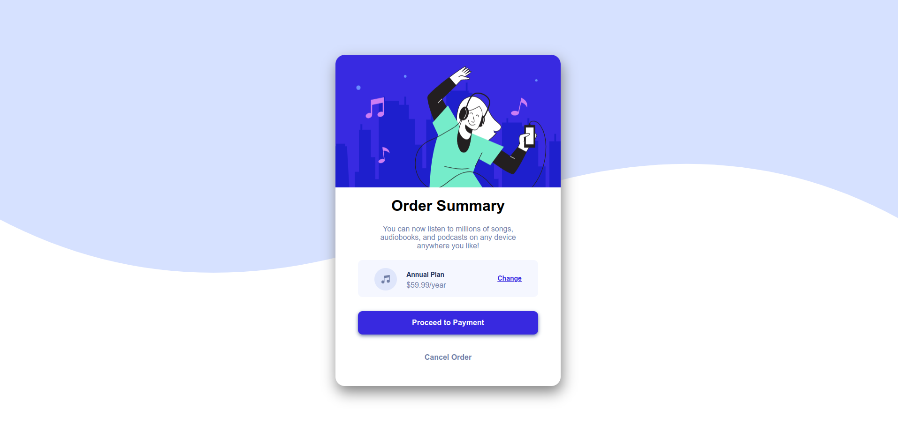
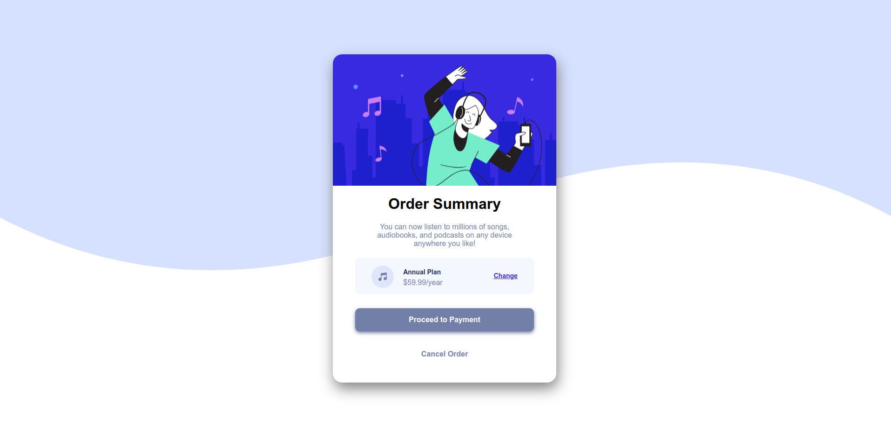

# Frontend Frenzy - Order summary card
Developed a Order summary card with HTML & CSS

# Learnings
- Practiced how to use flexbox to arrange components of my webpage
- Brought UI design to live with codes 
- Learnt how to design aesthetic buttons

# Core Langauges Used
HTML
CSS

# Core Concepts Used
Semantic HTML
CSS Flexbox

# Responsiveness
Renders well on desktop screen sizes

# Screenshot

